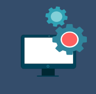
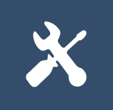

<!DOCTYPE html>
<html lang="en">
<head>
    <meta charset="UTF-8">
    <link rel="stylesheet" href="style.css">
   
    <title>Pagina web basica</title>
</head>
<body class="carregando">
    

        

            
        

        <nav class="navbar">
            <a href="index.html">Inicio</a>
            <a href="#">texto</a>
            <a href="#">contato</a>
            <a href="#">produtos</a> 
        </nav>
 
        </nav>

    

    <header class="content header">
        <h2 class="title">Inicio</h2>
        

        

            
 Este projeto foi elaborado no intuito de ajudar você pequeno ou grande 
                empreendedor a construir sua empresa do zero, informatizando-a. 
                Nesta página informamos alguns passos para a construção, desde a 
                compra de equipamentos, construção da rede do estabelecimento, 
                softwares necessários, segurança do local e até mesmo o contrato 
                dos profissionais responsáveis por cada área.
        

        

        

            <a href="#" class="btn">Saber mas</a>
            <a href="#" class="btn">Saber mas</a>
        

    </header>

    <section class="content sau">

        <h2 class="title"></h2>
        <h2>Selecione abaixo a área que você deseja obter Informações </h2>
        
        

        

        

        <main>
            

                <a href="#" class="btn"> Saber mais</a> 
                <a href="#" class="btn"> Saber mais</a> 
            

            

              
              
              
              
              
            

                
              

        </main>
        

    </section>

    <section class="content about">

        <h2 class="title">Sobre o site</h2>
        <h2>Este projeto foi elaborado no intuito de ajudar você pequeno ou grande empreendedor a construir sua empresa do zero, informatizando-a. Nesta página informamos alguns passos para a construção, desde a compra de equipamentos, construção da rede do estabelecimento, softwares necessários, segurança do local e até mesmo o contrato dos profissionais responsáveis por cada área.

        </h2>

        <a href="#" class="btn">Saber mais</a>

    </section>

    <section class="content price">

        <article class="contain">
            <h2 class="title">Precio</h2>
            
texto texto texto texto texto texto texto texto
            

            <a href="#" class="btn">Saber precio</a>

        </article>

    </section>

    <section class="content contact">
        <h2 class="title">Contacto</h2>
        
48481548

        <figure class="map">
            
        </figure>
    </section>
    
</body>
</html>

<!--                              

